<p align="center">
  <b>基于 <a href="https://github.com/LSPosed/LSPosed">Xposed API</a> 开发的自动化记账模块，通过高度灵活的本地规则配置与 AI 智能辅助，帮助用户轻松养成记账习惯、告别手动繁琐操作。</b>
</p>

<p align="center">
   
</p>

<p align="center">
  <strong>🖥️ 屏幕识别</strong> 支持 <strong>无障碍</strong>、<strong>Root</strong>、<strong>Shizuku</strong> 三种授权方式 · <strong>任意 App</strong> 账单识别 · <strong>Xposed 模式</strong> 下更精准、更自动化 · 识别渠道涵盖 <strong>应用内数据</strong>、<strong>应用通知</strong>、<strong>短信</strong>
</p>

<p align="center">
  <a href="https://ez-book.org/">📖 文档</a> • <a href="https://github.com/AutoAccountingOrg/AutoAccounting/issues">🐛 反馈</a> • <a href="https://github.com/orgs/AutoAccountingOrg/projects/1/views/2">📋 路线图</a>
</p>

---

|                                                       |                                                       |                                                       |
|-------------------------------------------------------|-------------------------------------------------------|-------------------------------------------------------|
|  | 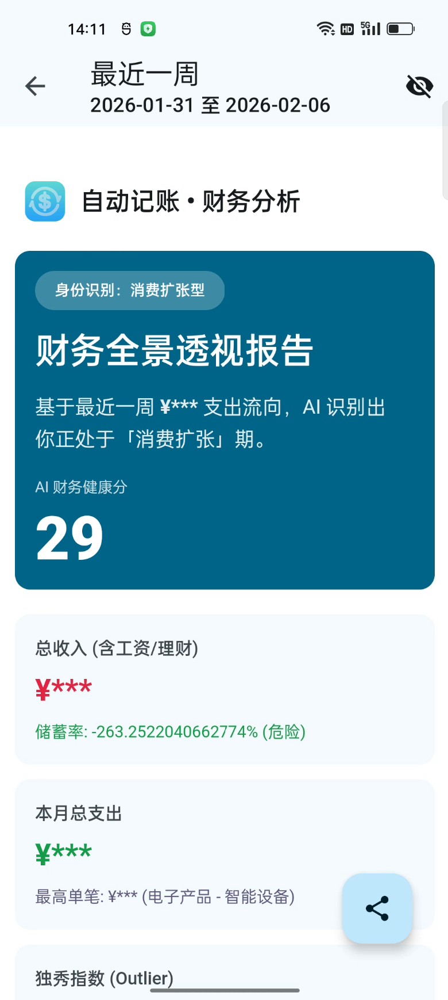 | 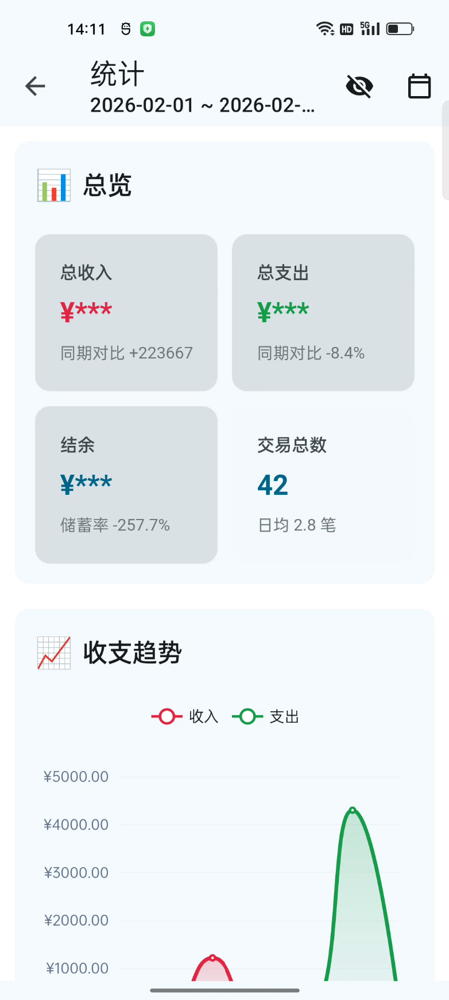 |
| 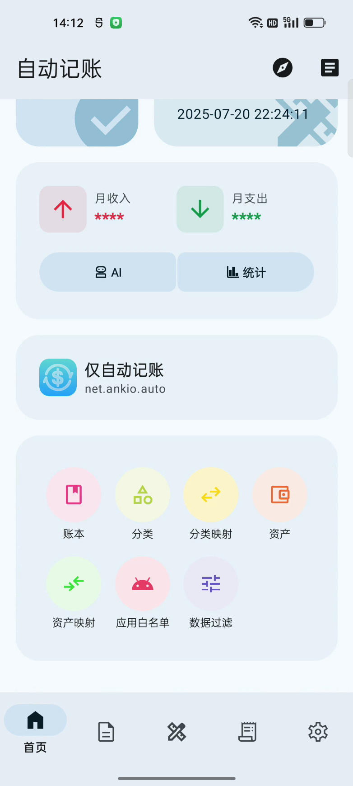 | 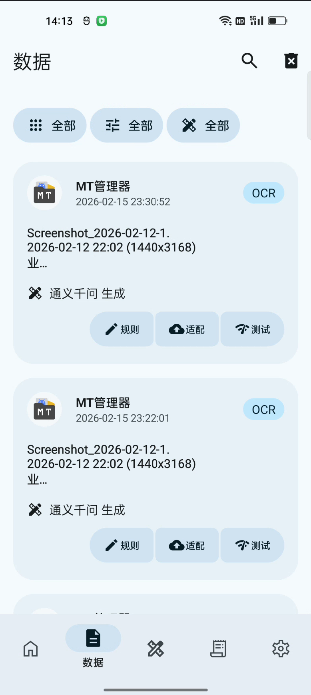 | 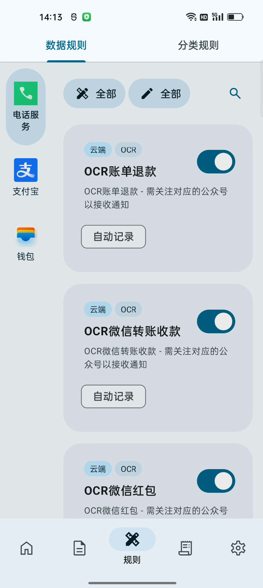 |
| 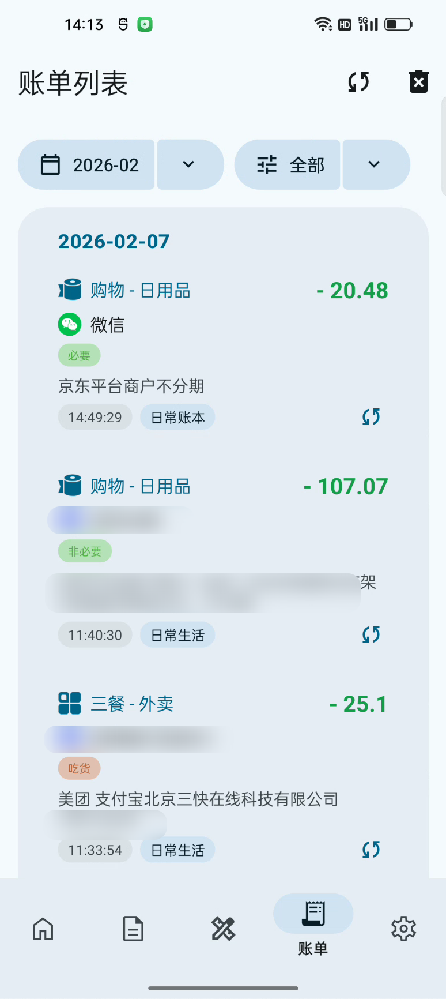 | 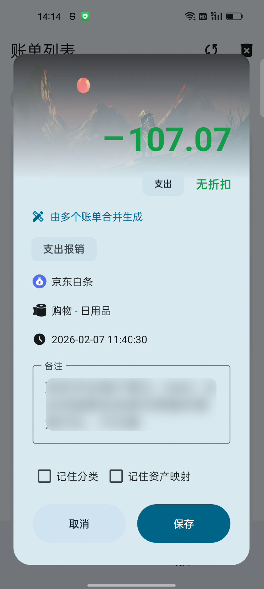 | 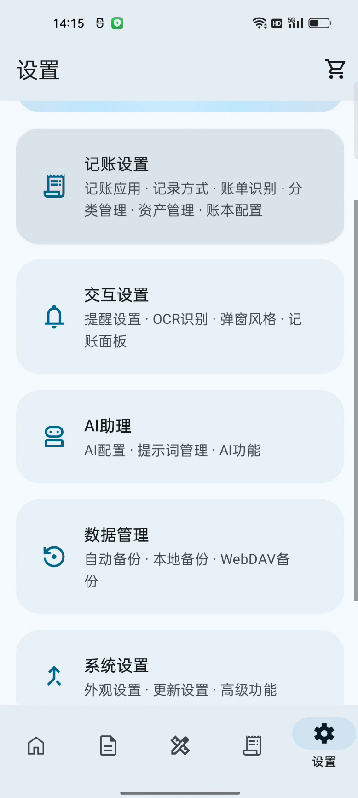 |
| 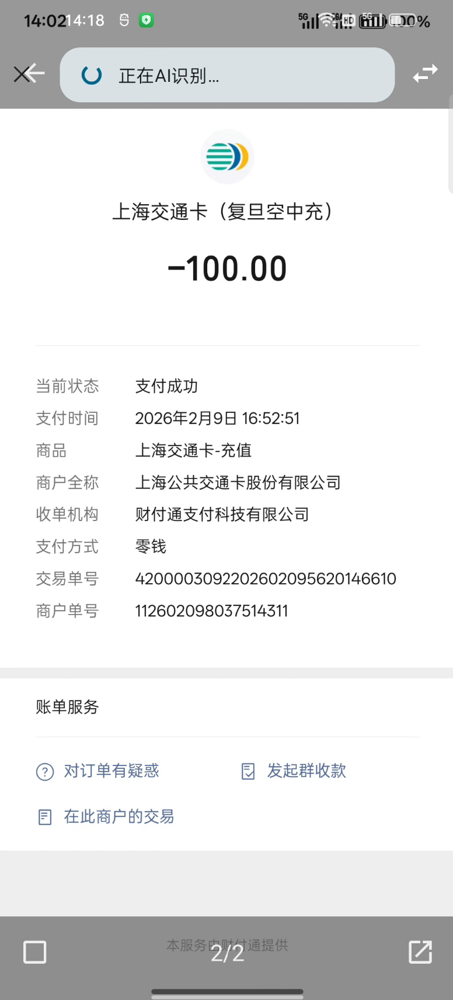 | 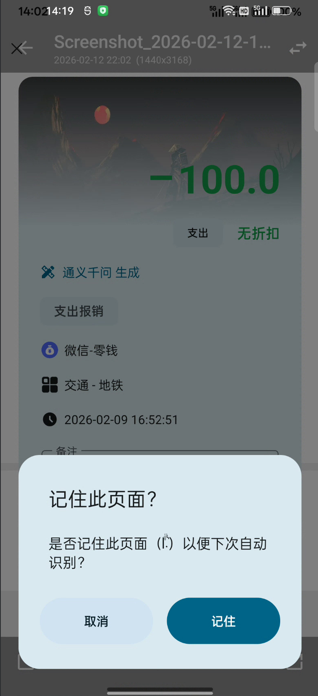 | 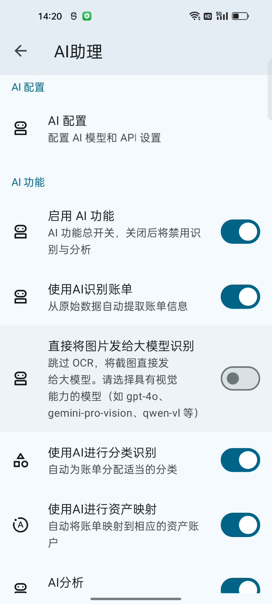 |

## ✨ 核心功能

| 功能                | 说明                                                                                       |
|-------------------|------------------------------------------------------------------------------------------|
| 🖥️ **屏幕识别（OCR）** | 支持 **无障碍**、**Root**、**Shizuku** 三种授权方式获取前台应用与截图，实现 **任意 App** 账单识别；无障碍模式下支持翻转触发、页面切换自动触发 |
| 📥 **多渠道识别**      | 识别渠道涵盖 **应用内数据**（Hook 微信/支付宝等）、**应用通知**、**短信**，全方位捕获账单信息                                 |
| 🧠 **规则驱动记账**     | 通过自定义规则自动识别消费与收入信息，支持关键词匹配、正则表达式、金额提取等多种配置方式                                             |
| 🤖 **AI 智能辅助**    | 集成 AI 识别技术，智能解析短信、推送、截图等内容，支持自动补全、智能纠错与分类建议                                              |
| 🔐 **数据本地化**      | 所有数据仅在设备端处理，绝不联网上传，严守隐私安全                                                                |

## 🔧 工作模式

自动记账 4.0 提供三种工作模式，请根据设备权限状况和使用偏好选择：

|         模式          |        适用条件         |                                        功能特点                                        |         推荐人群          |
|:-------------------:|:-------------------:|:----------------------------------------------------------------------------------:|:---------------------:|
| **LSPosed（Xposed）** | 已 Root + LSPosed 框架 |             **更精准、更自动化**：直接 Hook 应用内数据、通知、短信，无需截图即可获取原始数据；系统级自动化，功能最完整             |  追求功能完整性、已 Root 的用户   |
|     **LSPatch**     |   未 Root，可接受修改应用    |                  通过 LSPatch 修改应用，功能接近 Xposed 模式；屏幕识别支持 Shizuku 授权                  | 未 Root 但希望获得接近完整功能的用户 |
| **OCR 模式（无 Root）**  |   不 Root、不修改任何应用    | 依赖 **无障碍** / **Shizuku** 授权屏幕识别，支持 **任意 App** 账单识别；**无障碍模式下支持自动识别**（翻转触发、页面切换自动触发） |    注重系统完整性、不愿修改的用户    |

> [!TIP]
> 也可使用元萝卜、NewBlackDox、光速虚拟机等虚拟化容器，在虚拟机中使用 Root 模式功能。
>
> 详细说明请参阅
> 👉 [工作模式选择](https://www.ez-book.org/%E7%94%A8%E6%88%B7%E6%89%8B%E5%86%8C/%E5%87%86%E5%A4%87%E5%B7%A5%E4%BD%9C/%E5%B7%A5%E4%BD%9C%E6%A8%A1%E5%BC%8F%E9%80%89%E6%8B%A9.md)

## 💸 支持的记账软件

自动记账是一个**账单信息采集插件**，需要配合专业记账软件使用才能实现完整的记账流程。目前支持：

|                             软件名称                             |  兼容版本   |              备注              |
|:------------------------------------------------------------:|:-------:|:----------------------------:|
|               [钱迹记账](https://www.qianji.app/)                | 4.1.0+  | 从 4.0 Beta13 开始，钱迹补丁合并进入自动记账 |
| [一羽记账](https://www.coolapk.com/apk/com.github.nicekid1.yiyu) | v6.3.2+ |              —               |
|               [一木记账](https://www.yimuapp.com/)               |    —    |              —               |
|    [小星记账](https://www.coolapk.com/apk/com.xstar.chenzhuo)    | v3.5.0+ |              —               |

> 受限于各个软件的接口实现方式，功能支持情况有所不同，详见
> 👉 [记账软件选择](https://www.ez-book.org/%E7%94%A8%E6%88%B7%E6%89%8B%E5%86%8C/%E5%87%86%E5%A4%87%E5%B7%A5%E4%BD%9C/%E8%AE%B0%E8%B4%A6%E8%BD%AF%E4%BB%B6%E9%80%89%E6%8B%A9.md)

## 📱 识别渠道与支持的应用

**识别渠道**涵盖三类数据来源：

|    渠道     | 说明                                     |    Xposed 模式     | OCR 模式 |
|:---------:|:---------------------------------------|:----------------:|:------:|
| **应用内数据** | Hook 微信、支付宝等应用内部数据（数据库、消息盒子、WebView 等） |  ✅ 直接获取原始数据，最精准  |   —    |
| **应用通知**  | 读取通知栏推送（银行、支付、电商等 App 的消费提醒）           |   ✅ Hook 系统通知    | ✅ 通知权限 |
|  **短信**   | 银行、支付类短信验证码与消费提醒                       | ✅ Hook 短信 Intent | ✅ 短信权限 |

**屏幕识别（OCR 模式）** 支持 **任意 App** 账单识别，只需配置规则即可适配新应用。下表为部分常用应用示例：

|  应用/支付方式   |    接入方式     |                备注                |
|:----------:|:-----------:|:--------------------------------:|
|     微信     |  Hook / 通知  |     包括京东、京东支付、京东白条、各银行消费通知等      |
|    支付宝     |    Hook     |                —                 |
|    云闪付     |     通知      |        No-Root 环境下使用通知权限         |
|     短信     | Hook / 短信权限 |            主要适用于银行类短信            |
|     美团     |     通知      |        No-Root 环境下使用通知权限         |
|    招商银行    |     通知      |        No-Root 环境下使用通知权限         |
|   数字人民币    |     通知      |        No-Root 环境下使用通知权限         |
| **任意 App** |  OCR 屏幕识别   | 通过无障碍/Shizuku/Root 截图 + 规则/AI 解析 |

## 🚀 快速开始

1.
根据设备情况 [选择工作模式](https://www.ez-book.org/%E7%94%A8%E6%88%B7%E6%89%8B%E5%86%8C/%E5%87%86%E5%A4%87%E5%B7%A5%E4%BD%9C/%E5%B7%A5%E4%BD%9C%E6%A8%A1%E5%BC%8F%E9%80%89%E6%8B%A9.md)
，安装并激活模块
2. **屏幕识别模式**：选择 **无障碍** / **Root** / **Shizuku** 之一授权截图能力，即可识别任意 App 账单
3. 进入模块设置，按引导配置记账规则
4. 开启通知读取、短信等权限，以便从应用通知、短信渠道自动捕获账务信息
5. 如需 AI 辅助功能，请在设置中启用并完成相关配置

完整教程请参阅 👉 [官方文档](https://ez-book.org/)

## ⬇️ 下载

|                                                                           版本                                                                            |                说明                 |
|:-------------------------------------------------------------------------------------------------------------------------------------------------------:|:---------------------------------:|
| [Canary](https://cloud.ankio.net/%E8%87%AA%E5%8A%A8%E8%AE%B0%E8%B4%A6/%E8%87%AA%E5%8A%A8%E8%AE%B0%E8%B4%A6/%E7%89%88%E6%9C%AC%E6%9B%B4%E6%96%B0/Canary) | 每隔 3 小时自动构建，可能有新功能或 bug 修复，不保证可用性 |
|   [Beta](https://cloud.ankio.net/%E8%87%AA%E5%8A%A8%E8%AE%B0%E8%B4%A6/%E8%87%AA%E5%8A%A8%E8%AE%B0%E8%B4%A6/%E7%89%88%E6%9C%AC%E6%9B%B4%E6%96%B0/Beta)   |  测试版本，已通过小规模测试，具备高可用性，但仍可能存在 BUG  |
| [Stable](https://cloud.ankio.net/%E8%87%AA%E5%8A%A8%E8%AE%B0%E8%B4%A6/%E8%87%AA%E5%8A%A8%E8%AE%B0%E8%B4%A6/%E7%89%88%E6%9C%AC%E6%9B%B4%E6%96%B0/Stable) |           稳定版本，只修复 bug            |

## 🔍 常见问题自查

> [!TIP]
> 遇到问题时，请按以下步骤排查：
> 1. 检查数据中是否有相关的支付数据（没有可能是 bug）
> 2. 支付数据未被规则匹配？检查规则页面是否有对应规则（没有规则可长按首页更新按钮强制更新）
> 3. 有对应规则还没匹配上？检查日志是否报错（有报错请反馈 GitHub Issue）
> 4. 一切正常仍无法识别？点击数据页面的上传按钮上传数据到云端等待适配

## 🛠️ 编译步骤

```bash
git clone https://github.com/AutoAccountingOrg/AutoAccounting
```

使用 [Android Studio](https://developer.android.com/studio) 打开项目，等待自动配置完成后，点击菜单
`Build` → `Build Bundle(s) / APK(s)` → `Build APK(s)`。

## 🎉 参与贡献

我们诚挚邀请开发者与用户参与到自动记账项目中来！

- 🐛 **提交 Issue**：反馈使用问题或建议新功能
- 🔧 **发起 Pull Request**：改进代码逻辑或完善文档
- 📁 **分享规则配置**：帮助更多用户优化使用体验

> [!IMPORTANT]
> 提交代码/PR 前请**务必**先阅读 [贡献指南](CONTRIBUTING.md)。

<picture>
  <source media="(prefers-color-scheme: dark)" srcset="https://api.star-history.com/svg?repos=AutoAccountingOrg/AutoAccounting&type=Date&theme=dark" />
  <source media="(prefers-color-scheme: light)" srcset="https://api.star-history.com/svg?repos=AutoAccountingOrg/AutoAccounting&type=Date" />
  
</picture>

## 📝 License

Copyright © 2026 [Ankio](https://www.ankio.net).<br />
This project is [GPL3.0](https://github.com/AutoAccountingOrg/AutoAccounting/blob/master/LICENSE) licensed.
